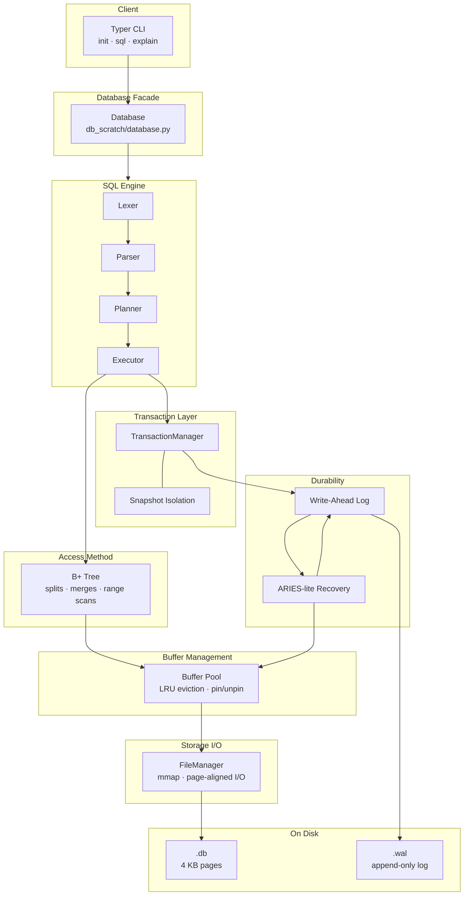
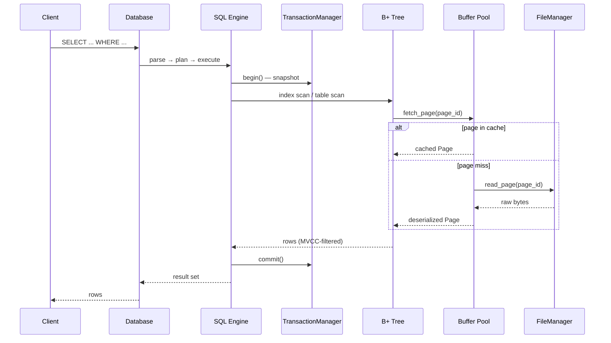
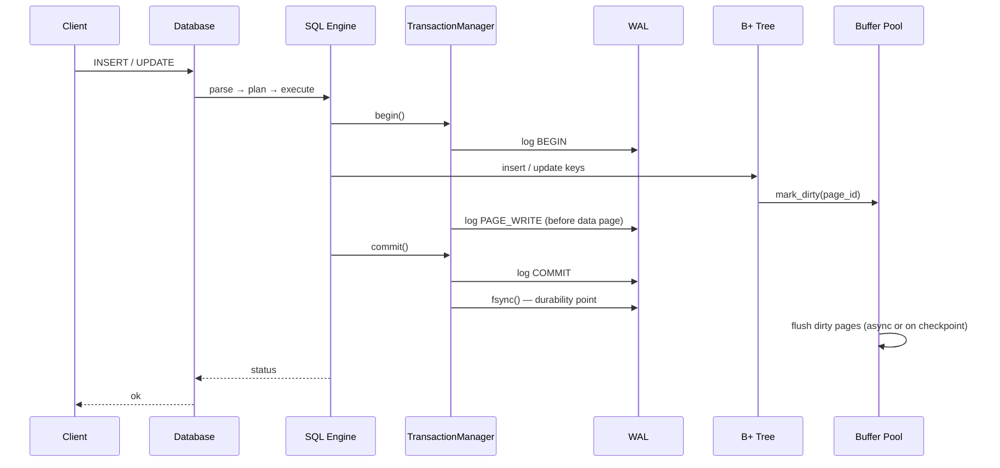
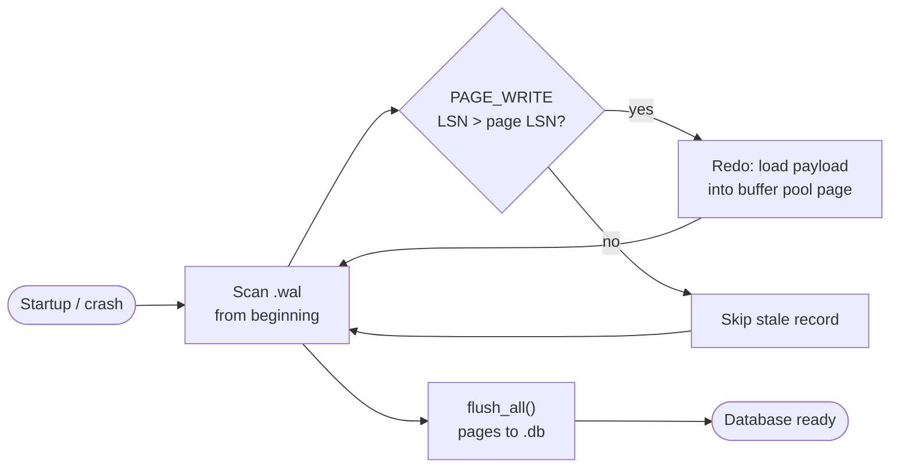

# DB_SCRATCH

A disk-backed relational database implemented from first principles in Python: fixed-size pages, a B+tree access method, write-ahead logging with crash recovery, MVCC snapshot isolation, and a SQL front-end (lexer → parser → planner → volcano executor).

No SQLite bindings. No ORM. No embedded query engine. Every layer is explicit code you can read, test, and reason about.

---

## Overview

DB_SCRATCH models the core architecture of production systems like PostgreSQL at a teachable scale. The storage engine owns persistence and indexing; the transaction layer owns atomicity, isolation, and the durability contract; the SQL layer compiles text into physical plans and drives the storage API.

The implementation is intentionally layered so each subsystem can be developed, tested, and reviewed in isolation before integration.

| Concern | Implementation | Production analogue |
|---------|----------------|---------------------|
| Addressing | 4 KB page IDs | PostgreSQL buffer tags |
| Indexing | On-disk B+tree | B-tree / GiST family |
| Durability | Append-only WAL + `fsync` | `pg_wal` |
| Recovery | ARIES-lite redo | Full ARIES (Mohan et al.) |
| Isolation | MVCC snapshot isolation | PostgreSQL default (RC/SI) |
| Query exec | Volcano iterator model | System R / Postgres executor |

---

## Design principles

1. **Page is the unit of I/O.** All disk reads and writes are page-aligned. The buffer pool caches pages, not rows.
2. **Log before data.** Dirty data pages are not considered durable until the describing WAL record is flushed (WAL protocol).
3. **Strict layering.** SQL does not call `mmap` directly; the B+tree does not parse SQL. Boundaries are enforced by module imports.
4. **Fail closed on corruption.** Invalid page sizes, unknown page types, and malformed WAL records raise explicit errors — no silent coercion.
5. **Observable internals.** `EXPLAIN` exposes the physical plan. Page headers carry LSNs for recovery debugging.

---

## Scope

### In scope

- Page-based file format with buffer pool (LRU eviction, pin/unpin, dirty tracking)
- B+tree with insert/delete, split/merge, and ordered range scans
- WAL with `BEGIN` / `COMMIT` / `ABORT` / `PAGE_WRITE` records
- Redo-only crash recovery (ARIES-lite)
- MVCC snapshot isolation for read visibility
- SQL subset: `CREATE`, `INSERT`, `SELECT`, `UPDATE`, `WHERE`, inner `JOIN`, `EXPLAIN`

### Explicitly out of scope (v1)

| Feature | Rationale |
|---------|-----------|
| Multi-version undo / rollback segments | Redo-only recovery; aborted txns discarded at replay |
| Fine-grained locking (row/page latches) | Single-threaded executor; MVCC provides read isolation |
| Cost-based optimizer | Rule-based planner sufficient for learning |
| Buffer pool clock / 2Q eviction | LRU is simpler to implement and reason about |
| Checkpoint / fuzzy checkpoint | Full WAL scan on startup is acceptable at this scale |
| SQL transactions across statements | One statement = one txn boundary in the executor |

These are documented gaps, not oversights — each is a deliberate simplification with a clear upgrade path.

---

## On-disk format

### Database file (`.db`)

The file is a contiguous array of fixed-size pages. Page 0 is reserved for metadata (root page pointer, format version — to be populated in phase 2).

```
┌──────────────────────────────────────────────┐
│ Page 0 — meta                                │
├──────────────────────────────────────────────┤
│ Page 1..N — B+tree internal / leaf / free    │
└──────────────────────────────────────────────┘
```

**Page header** (`storage/page.py`) — network byte order, 16 bytes:

| Offset | Field | Type | Notes |
|--------|-------|------|-------|
| 0 | `page_type` | `uint8` | `FREE`, `META`, `BTREE_INTERNAL`, `BTREE_LEAF`, `OVERFLOW` |
| 1 | `flags` | `uint8` | Reserved |
| 2 | `page_id` | `uint32` | Self-identifying page number |
| 6 | `lsn` | `uint32` | Last WAL record applied to this page |
| 10 | `free_space` | `uint16` | Bytes available in payload |
| 12 | padding | 6 bytes | Alignment |

Payload follows immediately after the header. B+tree node layout is defined in `btree/node.py`.

### Write-ahead log (`.wal`)

Append-only sequence of length-prefixed records:

```
[ header: type(u8) | txn_id(u32) | page_id(u32) ]
[ payload_len(u32) ]
[ payload: variable — full page image for PAGE_WRITE ]
```

| Record type | Purpose |
|-------------|---------|
| `BEGIN` | Transaction opened |
| `COMMIT` | Durability point — must be fsync'd before ack |
| `ABORT` | Transaction discarded |
| `PAGE_WRITE` | Redo image of a data page |
| `CHECKPOINT` | Reserved for future checkpoint metadata |

**LSN** is the byte offset of the record in the WAL file at append time.

---

## Architecture

A classic disk-backed RDBMS layout: SQL front-end on a transactional storage engine with log-structured durability.

### System layers



### Read path — `SELECT`



Reads never bypass the buffer pool. A transaction snapshot is taken at `begin()`; tuple visibility is evaluated against `txn/mvcc.py` rules before rows are returned.

### Write path — `INSERT` / `UPDATE`



**Durability contract:** `commit()` does not return until the `COMMIT` record is `fsync`'d. Data pages may be written lazily; redo can reconstruct them from the WAL after crash.

### Crash recovery



Recovery is **redo-only**. There is no undo phase: `ABORT` records mark intent but uncommitted `PAGE_WRITE` images are superseded by the redo LSN comparison. Production ARIES adds undo for in-flight transactions and compensation log records (CLRs); see [References](#references).

---

## Transaction semantics

### Isolation: snapshot isolation

Each `begin()` captures `Snapshot(txn_id, active_txns)`. A version `(creator_txn_id, committed)` is visible iff:

1. `creator_txn_id == snapshot.txn_id` — read your own writes
2. `committed == False` and rule 1 does not apply — invisible
3. `creator_txn_id ∈ snapshot.active_txns` — invisible (concurrent uncommitted)
4. Otherwise — visible

This prevents dirty reads and provides a stable read view for the statement's lifetime. Write skew and phantom reads are possible under SI — same trade-off PostgreSQL documents before serializable.

### Atomicity

A statement runs inside a single transaction. On success, `COMMIT` is logged and fsync'd. On any exception, `ABORT` is logged and in-memory state is discarded. The WAL is the source of truth across crashes.

### ACID mapping

| Property | Guarantee | Mechanism |
|----------|-----------|-----------|
| **Atomicity** | All-or-nothing per statement | `BEGIN` / `COMMIT` / `ABORT` in WAL |
| **Consistency** | B+tree order preserved; typed page layout | Structural invariants in `btree/`, `storage/page.py` |
| **Isolation** | Snapshot isolation | `txn/mvcc.py` visibility predicate |
| **Durability** | Committed work survives crash | WAL `fsync` at commit; redo on startup |

---

## Query processing

The SQL pipeline follows the classical compiler shape used in System R and its descendants:

```
SQL text
  → tokens        (lexer.py)
  → AST           (parser.py → ast.py)
  → physical plan (planner.py)
  → result rows   (executor.py — volcano model)
```

### Physical operators

| Operator | Role |
|----------|------|
| `SeqScan` | Full table iteration |
| `Filter` | Predicate evaluation (`WHERE`) |
| `NestedLoopJoin` | O(n·m) join — correct, not fast |
| `InsertPlan` / `UpdatePlan` / `CreateTablePlan` | DML and DDL |

The executor pulls tuples upward (Volcano / iterator model). Each operator implements `_execute_node` by recursively consuming its children. `EXPLAIN` prints the plan tree without executing side effects.

### Planner (v1)

Rule-based, not cost-based. Every `SELECT` gets a `SeqScan`; `WHERE` wraps a `Filter`; each `JOIN` adds a `NestedLoopJoin`. Sufficient for correctness and for demonstrating the plan → execute boundary.

---

## Subsystem contracts

Each module exposes a narrow API. Implementations are stubs with `TODO(phase-N)` markers — see `TODOS.txt` for the implementation checklist.

| Module | Contract | Key invariant |
|--------|----------|---------------|
| `storage/page.py` | Serialize/deserialize 4 KB pages | `len(to_bytes()) == page_size` always |
| `storage/file_manager.py` | Page-addressed I/O via `mmap` | `read_page(id)` returns exactly `page_size` bytes |
| `storage/buffer_pool.py` | Cache with LRU eviction | Pinned pages are never evicted |
| `btree/btree.py` | Ordered key/value index | Keys sorted within every leaf; internal nodes route correctly |
| `wal/wal.py` | Append-only durable log | `append()` returns monotonically increasing LSN |
| `wal/recovery.py` | Redo replay | Page LSN updated only when `record_lsn > page.lsn` |
| `txn/transaction.py` | Txn lifecycle | `commit()` fsyncs before returning |
| `txn/mvcc.py` | Visibility predicate | Pure function — no I/O |
| `sql/*` | Compile and execute SQL subset | Parser never touches storage directly |

---

## Project layout

```
db_scratch/
  database.py      # Facade — wires subsystems, exposes execute(sql)
  storage/         # Pages, mmap I/O, buffer pool
  btree/           # B+tree access method
  wal/             # Log + redo recovery
  txn/             # MVCC + transaction manager
  sql/             # Lexer, parser, planner, executor
  cli/             # Typer entrypoint
tests/
  test_smoke.py    # Per-phase tests (skipped until implemented)
TODOS.txt          # Implementation checklist with rationale
```

---

## Getting started

**Requirements:** Python ≥ 3.11, pip or uv.

```bash
pip install -e ".[dev]"
pytest -rs                    # all tests skipped until you implement each phase
```

Work through `TODOS.txt` in order. Un-skip tests in `tests/test_smoke.py` as each phase passes.

```bash
db-scratch init ./data/app.db
db-scratch sql ./data/app.db "CREATE TABLE users (id INT, name TEXT)"
db-scratch explain ./data/app.db "SELECT id FROM users WHERE id = 1"
```

---

## Tech stack

| Area | Choice | Why |
|------|--------|-----|
| Runtime | Python 3.11+ | Readable internals; fast iteration on algorithms |
| Packaging | uv / pip + `pyproject.toml` | Standard tooling |
| Page I/O | `mmap`, `struct`, `memoryview` | Zero-copy page access; explicit binary layout |
| SQL parsing | Hand-rolled recursive descent | Full control; matches how engines are taught |
| CLI | Typer | Thin command surface |
| Tests | pytest + Hypothesis | Unit tests per layer; property tests for B+tree invariants |
| Static analysis | ruff, pyright | Enforce types on `Page`, `PlanNode`, `Transaction` |

---

## Testing strategy

Tests are organized by subsystem, not by feature flag:

1. **Storage** — page round-trip, file I/O, buffer pool hit/miss/eviction
2. **B+tree** — node serialization, insert/lookup/scan ordering
3. **WAL** — record encode/decode, append/replay idempotency
4. **Recovery** — crash simulation: write WAL, truncate data file, redo restores state
5. **Transactions** — visibility matrix for concurrent txn IDs
6. **SQL** — parse → plan → execute golden paths

Property-based tests (Hypothesis) are recommended for B+tree invariants: key order preserved after arbitrary insert/delete sequences.

---

## Implementation roadmap

| Phase | Modules | Delivers |
|-------|---------|----------|
| 1 | `storage/*` | Durable page I/O |
| 2 | `btree/*` | Ordered index on disk |
| 3 | `wal/*` | Crash-safe writes |
| 4 | `txn/*` | ACID transaction boundary |
| 5 | `sql/*` | Query language surface |

Full task list with explanations: **`TODOS.txt`**.

---

## References

- [ARIES: A Transaction Recovery Method](https://www.cs.utexas.edu/~gouda/lecture/notes/paper-1.pdf) — Mohan et al.; redo/undo framework (this project implements redo only)
- [The Design and Implementation of PostgreSQL](https://www.interdb.jp/pg/) — practical mapping from theory to a production system
- [Architecture of a Database System](https://dsf.berkeley.edu/papers/fntdb07-architecture.pdf) — Hellerstein, Stonebraker, Hamilton; layer overview
- [The Volcano Optimizer Generator](https://ieeexplore.ieee.org/document/645487) — Graefe; iterator model for query execution
- Phil Eaton's [Postgres from scratch](https://postgres.how/) series — same learning genre, C implementation
